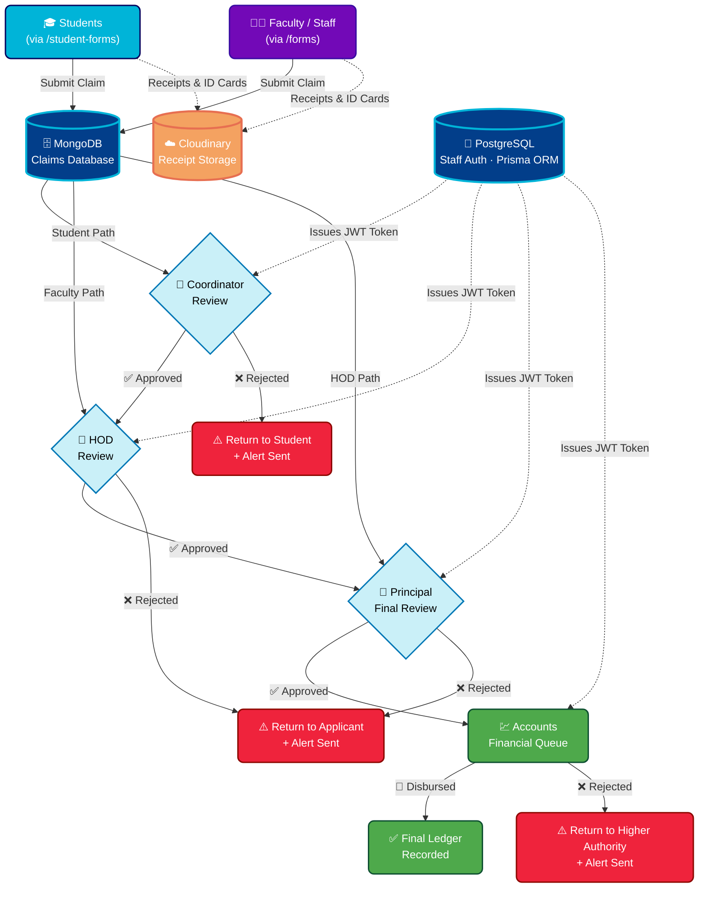

<div align="center">

<!-- ═══════════════════════════════════════════════════════════════ -->
<!--                     CINEMATIC HERO BANNER                      -->
<!-- ═══════════════════════════════════════════════════════════════ -->


</div>

<!-- ═══════════════════════════════════════════════════════════════ -->
<!--                     BADGE ROW — TIER 1                         -->
<!-- ═══════════════════════════════════════════════════════════════ -->

<div align="center">

[](https://reimbursement-automation-system-new-nu.vercel.app)
&nbsp;

&nbsp;

&nbsp;


</div>

<br />

<!-- ═══════════════════════════════════════════════════════════════ -->
<!--                     ANIMATED TYPING SVG                        -->
<!-- ═══════════════════════════════════════════════════════════════ -->

<p align="center">
  
</p>

<br />

<!-- ═══════════════════════════════════════════════════════════════ -->
<!--                     QUICK STATS ROW                            -->
<!-- ═══════════════════════════════════════════════════════════════ -->

<div align="center">

| 🎓 Users Supported | 🔗 Approval Stages | 🛡️ Auth Method | 🗄️ Databases | ☁️ Cloud Storage |
|:---:|:---:|:---:|:---:|:---:|
| Students · Faculty · HOD · Coordinator · Principal · Accounts | **5 Stages** | **JWT Tokens** | **MongoDB + PostgreSQL** | **Cloudinary** |

</div>

<br />

---

<!-- ═══════════════════════════════════════════════════════════════ -->
<!--                     TABLE OF CONTENTS                          -->
<!-- ═══════════════════════════════════════════════════════════════ -->

<details open>
<summary><b>📑 &nbsp; Table of Contents &nbsp; — Click to Navigate</b></summary>

<br />

> | # | Section | Description |
> |:---:|:---|:---|
> | 01 | [🎬 The Problem](#-01--the-problem--the-invisible-enemy) | Why this system was built |
> | 02 | [🌟 The Solution](#-02--the-solution--our-digital-gateway) | What this platform delivers |
> | 03 | [⚡ Key Features](#-03--key-features--power--performance) | All major capabilities |
> | 04 | [👥 User Roles](#-04--user-roles--who-uses-what) | Role-based portal breakdown |
> | 05 | [🌌 Architecture](#-05--architecture--the-engine-room) | System design & Mermaid diagram |
> | 06 | [🛠️ Tech Stack](#️-06--tech-stack--the-arsenal) | All technologies used |
> | 07 | [🔐 Security](#-07--security--the-fortress) | Auth & data protection |
> | 08 | [👨‍💻 Developers](#-08--the-cast--meet-our-developers) | Team members |
> | 09 | [🚀 Deployment](#-09--deployment--launch-sequence) | Setup & deployment guide |
> | 10 | [🗺️ Roadmap](#️-10--roadmap--future-missions) | Upcoming features |

</details>

<br />

---

<!-- ═══════════════════════════════════════════════════════════════ -->
<!--                     SECTION 01 — THE PROBLEM                   -->
<!-- ═══════════════════════════════════════════════════════════════ -->

## 🎬 `01` · The Problem — The Invisible Enemy


<br />

<table>
<tr>
<td width="60%">

> ### 📜 The Old World
>
> *For years, college administration has battled an invisible enemy:*
> ***The Paper Trail.***
>
> Lost receipts vanished into overcrowded folders. Manual approvals sat untouched on physical desks for days. Students submitting NPTEL reimbursements had zero visibility into where their request stood. The Accounts Desk was perpetually overwhelmed with untracked, unverified paperwork.
>
> The process was **slow**, **opaque**, and **frustrating** for every stakeholder — from first-year students to the Principal's office.
>
> ***It was time for a change. A big one.***

</td>
<td width="40%" align="center">

```
❌  BEFORE THIS SYSTEM
━━━━━━━━━━━━━━━━━━━━━━

📄 Paper form submitted
     ↓
🗂️  Dropped in a folder
     ↓
❓  Unknown whereabouts
     ↓
⏳  Days / Weeks pass
     ↓
📞  Student calls to follow up
     ↓
😤  No one has an answer
     ↓
💸  Reimbursement delayed
```

</td>
</tr>
</table>

<br />

---

<!-- ═══════════════════════════════════════════════════════════════ -->
<!--                     SECTION 02 — THE SOLUTION                  -->
<!-- ═══════════════════════════════════════════════════════════════ -->

## 🌟 `02` · The Solution — Our Digital Gateway


<br />


### Enter the **Reimbursement Automation System**

Engineered for **speed**, **transparency**, and **accountability** — this high-performance platform completely digitizes the expense claim lifecycle from submission to final ledger entry.

By replacing physical desks with **Role-Based Digital Portals**, we've created a seamless, unbroken chain of command:

```
🎓 Student Submits
        ↓
👔 Coordinator Reviews    ← Instant notification
        ↓
🏢 HOD Approves          ← Real-time dashboard update
        ↓
👑 Principal Signs Off   ← Analytics + audit trail
        ↓
💹 Accounts Disburses    ← Auto-queued, zero manual entry
        ↓
✅ Final Ledger Recorded  ← Full digital audit log
```

> **No lost papers. No manual tracking. No phone calls. Just pure digital throughput.**

<br clear="both" />

<table>
<tr>
<td align="center" width="25%">
<h3>⏱️</h3>
<b>~10x Faster</b><br/>
<sub>vs. manual process</sub>
</td>
<td align="center" width="25%">
<h3>👁️</h3>
<b>100% Transparent</b><br/>
<sub>real-time status tracking</sub>
</td>
<td align="center" width="25%">
<h3>🔒</h3>
<b>Zero Data Loss</b><br/>
<sub>cloud-backed receipts</sub>
</td>
<td align="center" width="25%">
<h3>📊</h3>
<b>Full Audit Trail</b><br/>
<sub>every action logged</sub>
</td>
</tr>
</table>

<br />

---

<!-- ═══════════════════════════════════════════════════════════════ -->
<!--                     SECTION 03 — KEY FEATURES                  -->
<!-- ═══════════════════════════════════════════════════════════════ -->

## ⚡ `03` · Key Features — Power & Performance


<br />

<div align="center">

</div>

<br />

<table>
<thead>
<tr>
<th align="center">Icon</th>
<th align="left">Feature</th>
<th align="left">Description</th>
<th align="center">Benefit</th>
</tr>
</thead>
<tbody>
<tr>
<td align="center">🛡️</td>
<td><b>Role-Based Portals</b></td>
<td>Dedicated, secure UI views tailored for <b>Students, Faculty, HOD, Coordinator, Principal, and Accounts</b>. Every user sees only what they need.</td>
<td align="center"><code>Security</code></td>
</tr>
<tr>
<td align="center">🔀</td>
<td><b>Smart Queue Logistics</b></td>
<td>Requests flow systematically down the administrative approval chain. Final Principal approvals instantly auto-queue to the Accounts department — zero manual handoff.</td>
<td align="center"><code>Automation</code></td>
</tr>
<tr>
<td align="center">📊</td>
<td><b>Real-Time Analytics</b></td>
<td>HOD & Principal dashboards display live organizational metrics, pending task loads, approval rates, and historical budget utilization charts.</td>
<td align="center"><code>Visibility</code></td>
</tr>
<tr>
<td align="center">🔔</td>
<td><b>Notification Matrix</b></td>
<td>In-app, color-coded toast alerts ensure ultra-fast communication across all administrative tiers — approvals, rejections, and change requests are delivered instantly.</td>
<td align="center"><code>Speed</code></td>
</tr>
<tr>
<td align="center">📂</td>
<td><b>Secure Receipt Vault</b></td>
<td>Attach, encrypt, and render digital receipts, fee structures, and ID cards. Stored securely via Cloudinary with contextual access boundaries per role.</td>
<td align="center"><code>Compliance</code></td>
</tr>
<tr>
<td align="center">🔐</td>
<td><b>JWT Authentication</b></td>
<td>All administrative staff actions are gated by JSON Web Tokens issued from PostgreSQL. Stateless, secure, and tamper-proof session management.</td>
<td align="center"><code>Trust</code></td>
</tr>
<tr>
<td align="center">🗄️</td>
<td><b>Dual-Database Architecture</b></td>
<td>MongoDB handles flexible form/claim data with schema-free agility. PostgreSQL manages structured staff authentication with relational integrity and Prisma ORM.</td>
<td align="center"><code>Reliability</code></td>
</tr>
<tr>
<td align="center">📱</td>
<td><b>Fully Responsive UI</b></td>
<td>TailwindCSS + Framer Motion deliver a buttery-smooth, mobile-first experience with cinematic page transitions and micro-interactions on every device.</td>
<td align="center"><code>UX</code></td>
</tr>
</tbody>
</table>

<br />

---

<!-- ═══════════════════════════════════════════════════════════════ -->
<!--                     SECTION 04 — USER ROLES                    -->
<!-- ═══════════════════════════════════════════════════════════════ -->

## 👥 `04` · User Roles — Who Uses What


<br />

<details>
<summary><b>🎓 Student Portal</b> — Submit & Track Claims</summary>

<br />

> **Access:** `/student-forms`
>
> Students can:
> - Submit reimbursement claims (NPTEL, hackathons, events, etc.)
> - Upload receipts, fee structures, and ID cards to Cloudinary
> - Track real-time claim status through the approval pipeline
> - Receive instant in-app notifications on approval or rejection
> - View full submission history and disbursed amounts

</details>

<details>
<summary><b>👨‍🏫 Faculty / Staff Portal</b> — Direct HOD Submission</summary>

<br />

> **Access:** `/forms`
>
> Faculty & Staff can:
> - Submit expense claims that **bypass the Coordinator stage** and go directly to the HOD
> - Upload supporting documents securely
> - Track approval progress in real-time
> - View personal reimbursement history and status

</details>

<details>
<summary><b>👔 Coordinator Portal</b> — First-Level Review</summary>

<br />

> **Access:** Coordinator Dashboard
>
> Coordinators can:
> - Review all incoming student submissions
> - Approve and forward to HOD, or reject with comments
> - View department-wide pending queue
> - Receive JWT-authenticated session for secure action logging

</details>

<details>
<summary><b>🏢 HOD Portal</b> — Department Head Review</summary>

<br />

> **Access:** HOD Dashboard
>
> HODs can:
> - Review submissions forwarded from Coordinators (students) or directly from Faculty
> - Access real-time analytics: pending load, approval rate, budget utilization
> - Approve/reject with forwarding to Principal
> - Submit their own reimbursement claims directly to the Principal

</details>

<details>
<summary><b>👑 Principal Portal</b> — Final Authority</summary>

<br />

> **Access:** Principal Dashboard
>
> The Principal can:
> - Perform final approval/rejection on all HOD-forwarded claims
> - Access organization-wide analytics, charts, and budget summaries
> - Trigger auto-queuing to Accounts upon approval
> - Full audit trail visibility across all departments

</details>

<details>
<summary><b>💹 Accounts Portal</b> — Disbursement & Ledger</summary>

<br />

> **Access:** Accounts Dashboard
>
> Accounts staff can:
> - Receive auto-queued, Principal-approved reimbursement requests
> - Mark disbursements as processed
> - Record entries into the final financial ledger
> - Reject back to higher authority if discrepancies are found

</details>

<br />

---

<!-- ═══════════════════════════════════════════════════════════════ -->
<!--                     SECTION 05 — ARCHITECTURE                  -->
<!-- ═══════════════════════════════════════════════════════════════ -->

## 🌌 `05` · Architecture — The Engine Room


<br />

> Behind the polished UI lies a **robust, enterprise-grade architecture** built to handle the highest volumes of campus traffic with absolute data integrity and zero single points of failure.

<br />



<br />

### 🗂️ Architecture Summary

| Layer | Technology | Purpose |
|:---|:---|:---|
| **Frontend** | React + Vite + TailwindCSS + Framer Motion | Blazing-fast SPA with animated, responsive UI |
| **Backend API** | Node.js + Express | RESTful API on port `5000` |
| **Primary DB** | MongoDB Atlas | Flexible claim/form data storage |
| **Auth DB** | PostgreSQL + Prisma ORM | Structured staff authentication & role management |
| **File Storage** | Cloudinary | Encrypted cloud storage for receipts & documents |
| **Auth Layer** | JWT (JSON Web Tokens) | Stateless, secure session management |
| **Deployment** | Vercel (frontend) · NGINX (college servers) | Enterprise-grade static hosting |

<br />

---

<!-- ═══════════════════════════════════════════════════════════════ -->
<!--                     SECTION 06 — TECH STACK                    -->
<!-- ═══════════════════════════════════════════════════════════════ -->

## 🛠️ `06` · Tech Stack — The Arsenal


<br />

> We armed ourselves with the most modern, blistering-fast technologies available. Every choice was deliberate — optimized for **developer velocity**, **runtime performance**, and **long-term maintainability**.

<br />

<div align="center">

### 🖥️ Frontend


### ⚙️ Backend & Runtime


### 🗄️ Databases & Storage


### 🚀 DevOps & Deployment


</div>

<br />

<table>
<tr>
<td width="50%">

#### Why React + Vite?
Vite's lightning-fast HMR (Hot Module Replacement) and optimized production bundling means near-instant dev feedback loops and tiny bundle sizes shipped to users. React's component model scales cleanly as portal complexity grows.

</td>
<td width="50%">

#### Why MongoDB + PostgreSQL?
MongoDB handles schema-flexible claim documents with rich, nested attachments. PostgreSQL handles structured, relational staff authentication where data integrity is non-negotiable. Two databases, each playing to its strengths.

</td>
</tr>
</table>

<br />

---

<!-- ═══════════════════════════════════════════════════════════════ -->
<!--                     SECTION 07 — SECURITY                      -->
<!-- ═══════════════════════════════════════════════════════════════ -->

## 🔐 `07` · Security — The Fortress


<br />

```
┌─────────────────────────────────────────────────────────────────┐
│                    SECURITY ARCHITECTURE                         │
├──────────────────┬──────────────────────────────────────────────┤
│  Layer           │  Implementation                              │
├──────────────────┼──────────────────────────────────────────────┤
│  Authentication  │  JWT (HS256) issued by PostgreSQL auth layer  │
│  Authorization   │  Role-based middleware on every API route     │
│  File Security   │  Cloudinary signed uploads + CDN delivery     │
│  Transport       │  HTTPS enforced across all endpoints          │
│  Data Storage    │  MongoDB Atlas encryption-at-rest             │
│  Secrets Mgmt    │  Environment variables — never committed      │
└──────────────────┴──────────────────────────────────────────────┘
```

> ⚠️ **Zero-Trust Principle:** No user action is trusted without a valid, role-verified JWT. Even internal API-to-API calls pass through the authentication middleware layer.

<br />

---

<!-- ═══════════════════════════════════════════════════════════════ -->
<!--                     SECTION 08 — THE TEAM                      -->
<!-- ═══════════════════════════════════════════════════════════════ -->

## 👨‍💻 `08` · The Cast — Meet Our Developers


<br />

> This system was proudly **engineered, designed, and deployed** by our institution's own computer science students — built from the ground up to solve a real and critical campus workflow problem.

<br />

<div align="center">

<table>
<tr>
<td align="center" width="25%">
  <a href="https://github.com/FutureAlok1445">
    
  </a>
  <br /><br />
  <b><a href="https://github.com/FutureAlok1445">Alok</a></b>
  <br />
  <sub></sub>
  <br />
  <sub>Backend Architecture · API Design · Database Engineering</sub>
</td>

<td align="center" width="25%">
  <a href="https://github.com/Oriacgz">
    
  </a>
  <br /><br />
  <b><a href="https://github.com/Oriacgz">Apoorva</a></b>
  <br />
  <sub></sub>
  <br />
  <sub>API Integration · Auth System · Workflow Logic</sub>
</td>

<td align="center" width="25%">
  <a href="https://github.com/Nirmala1914">
    
  </a>
  <br /><br />
  <b><a href="https://github.com/Nirmala1914">Nirmala</a></b>
  <br />
  <sub></sub>
  <br />
  <sub>UI/UX Design · Component Library · Animations</sub>
</td>

<td align="center" width="25%">
  <a href="https://github.com/Vai-15">
    
  </a>
  <br /><br />
  <b><a href="https://github.com/Vai-15">Vaibhavi</a></b>
  <br />
  <sub></sub>
  <br />
  <sub>Responsive Design · Dashboard UI · User Research</sub>
</td>
</tr>
</table>

</div>

<br />

---

<!-- ═══════════════════════════════════════════════════════════════ -->
<!--                     SECTION 09 — DEPLOYMENT                    -->
<!-- ═══════════════════════════════════════════════════════════════ -->

## 🚀 `09` · Deployment — Launch Sequence


<br />

> This platform is a strictly **Enterprise-Ready, Closed-Source** system for institutional use. Deployment is managed exclusively by authorized College IT Staff.

<br />

### 📋 Prerequisites

Before deploying, ensure the following are provisioned:

- ✅ **Node.js** v20+ and **npm** v9+
- ✅ **MongoDB Atlas** cluster (or self-hosted instance)
- ✅ **PostgreSQL** database (v15+)
- ✅ **Cloudinary** account with upload preset configured
- ✅ **NGINX** or compatible web server for static file hosting

<br />

### 🔑 Step 1 — Environment Setup

Create a `.env` file in both `./backend/server` and `./front-end` with the following keys:

```env
# ─── Backend .env ──────────────────────────────────────────────────

# MongoDB
MONGODB_URI=mongodb+srv://<user>:<password>@cluster.mongodb.net/<dbname>

# PostgreSQL (Prisma)
DATABASE_URL=postgresql://<user>:<password>@<host>:<port>/<dbname>?schema=public

# Cloudinary
CLOUDINARY_CLOUD_NAME=your_cloud_name
CLOUDINARY_API_KEY=your_api_key
CLOUDINARY_API_SECRET=your_api_secret

# JWT
JWT_SECRET=your_super_secure_random_secret_minimum_32_chars
JWT_EXPIRES_IN=7d

# Server
PORT=5000
NODE_ENV=production
```

<br />

### ⚙️ Step 2 — Initialize the Backend

```bash
# Navigate to the backend directory
cd backend/server

# Install all dependencies
npm install

# Generate Prisma client and sync the PostgreSQL schema
npm run prisma:generate
npx prisma migrate deploy

# Start the backend API server (port 5000)
npm run dev
```

> ✅ The API will be live at `http://localhost:5000`

<br />

### 🎨 Step 3 — Build & Serve the Frontend

```bash
# Navigate to the frontend directory
cd front-end

# Install all dependencies
npm install

# Build the production-optimized static payload
npm run build

# The output is in ./dist — point NGINX to this directory
```

<br />

### 🌐 Step 4 — NGINX Configuration (Sample)

```nginx
server {
    listen 80;
    server_name your-college-domain.edu;

    root /var/www/reimbursement/dist;
    index index.html;

    # React SPA fallback — all routes to index.html
    location / {
        try_files $uri $uri/ /index.html;
    }

    # Proxy API requests to Node.js backend
    location /api/ {
        proxy_pass http://localhost:5000;
        proxy_http_version 1.1;
        proxy_set_header Upgrade $http_upgrade;
        proxy_set_header Connection 'upgrade';
        proxy_set_header Host $host;
        proxy_cache_bypass $http_upgrade;
    }
}
```

<br />

### ✅ Step 5 — Verify Deployment

```bash
# Health check endpoint
curl http://localhost:5000/api/health

# Expected response:
# { "status": "ok", "uptime": "...", "database": "connected" }
```

<br />

---

<!-- ═══════════════════════════════════════════════════════════════ -->
<!--                     SECTION 10 — ROADMAP                       -->
<!-- ═══════════════════════════════════════════════════════════════ -->

## 🗺️ `10` · Roadmap — Future Missions


<br />

| Status | Feature | Description |
|:---:|:---|:---|
| ✅ | Role-Based Auth | Fully deployed |
| ✅ | Approval Pipeline | Fully deployed |
| ✅ | Real-Time Notifications | Fully deployed |
| ✅ | Cloudinary File Vault | Fully deployed |
| 🔄 | Email Notification Layer | Automatic email alerts on stage transitions |
| 🔄 | PDF Export | Downloadable reimbursement reports for Accounts |
| 🔜 | Mobile App | React Native companion app for on-the-go approvals |
| 🔜 | Budget Forecasting | AI-powered semester budget utilization prediction |
| 🔜 | Multi-Institution | Support for multiple colleges under one deployment |
| 🔜 | Bulk Disbursement | Batch-process multiple approved claims at once |

<br />

---

<!-- ═══════════════════════════════════════════════════════════════ -->
<!--                     FOOTER                                     -->
<!-- ═══════════════════════════════════════════════════════════════ -->

<br />

<div align="center">


<br />

[](https://reimbursement-automation-system-new-nu.vercel.app)

<br />

*© 2024 Reimbursement Automation System · All Rights Reserved · Closed Source · Enterprise Use Only*


</div>