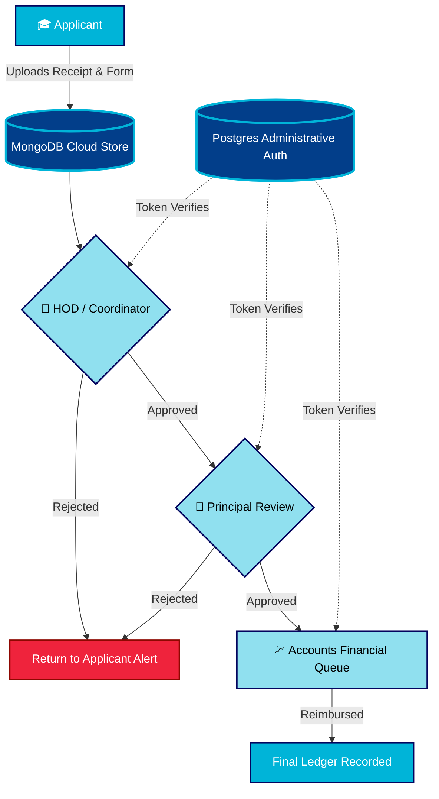

  

  

  

---

## 🎬 Prologue: The Problem

> *For years, college administration has battled an invisible enemy: **The Paper Trail**. Lost receipts, untracked approvals, and endless queues at the Accounts Desk. The reimbursement process was slow, frustrating, and lacked transparency. Stakeholders were left in the dark. It was time for a change.*

---

## 🌟 The Hero: Our Digital Gateway

Enter the **Reimbursement Automation System**. Engineered for speed, transparency, and accountability, this high-performance platform completely digitizes the expense claim lifecycle.

By replacing physical desks with **Role-Based Digital Portals**, we've created a seamless, unbroken chain of command. When a student submits an NPTEL receipt, it doesn't vanish into a folder—it instantly appears on the HOD's dashboard. Upon approval, it flies to the Principal, and finally, directly into the Accounts ledger.

**No lost papers. No manual tracking. Just pure digital throughput.**

 

---

## ⚡ Power & Performance: Key Features

  

| Feature | Description |
| :--- | :--- |
| 🛡️ **Role-Based Portals** | Dedicated, secure UI views tailored specifically for **Students, Faculty, HOD, Coordinator, Principal, and Accounts**. Every user sees only what they need to see. |
| 🔀 **Smart Queue Logistics** | Requests progress systematically down the administrative approval chain. Final Principal approvals trigger immediate auto-queueing for the Accounts department. |
| 📊 **Real-Time Analytics** | The Principal & HOD dashboards burst into life with high-level organizational metrics, pending task loads, and historical budget utilization charts. |
| 🔔 **Notification Matrix** | In-app, color-coded toast alerts ensure ultra-fast communication between administrative tiers, notifying users of approvals or requested changes instantly. |
| 📂 **Secure Vault** | Attach, encrypt, and render digital receipts, fee structures, and ID cards within contextual boundaries. Receipts are stored securely via the cloud. |

---

## 🌌 The Engine Room: Architecture Workflow

Behind the beautiful UI lies a robust, enterprise-grade architecture. Our engine is built to handle the highest volumes of campus traffic with absolute data integrity.

---

## 🛠️ The Arsenal: Tech Stack

We armed ourselves with the most modern, blistering-fast technologies available.

  
  
  
  
  
  
  
  

---

## 🎬 The Cast: Meet Our Developers

This system was proudly engineered, designed, and deployed by our institution's own computer science developers to solve a critical campus workflow issue.

 

  
|  |  |  |  |
| :---: | :---: | :---: | :---: |
| **[Alok](https://github.com/FutureAlok1445)** | **[Apoorva](https://github.com/Oriacgz)** | **[Nirmala](https://github.com/Nirmala1914)** | **[Vaibhavi](https://github.com/Vai-15)** |
| *Full-Stack Developer* | *Full-Stack Developer* | *Frontend/Design Specialist* | *Frontend/Design Specialist* |

---

## � Epilogue: Deployment

This platform is strictly an Enterprise-Ready closed-source system. 

**Quick-Start for College IT Staff:**
1. Populate local `.env` values mapping `MONGODB`, `POSTGRES`, and `CLOUDINARY` URIs.
2. Initialize database dependencies via `npm run prisma:generate` inside `./backend/server`.
3. Ignite the backend API on port `5000` (`npm run dev`).
4. Build the Vite frontend payload (`npm run build`) in `./front-end` and map the static artifacts to NGINX on your local college servers.

---

  

